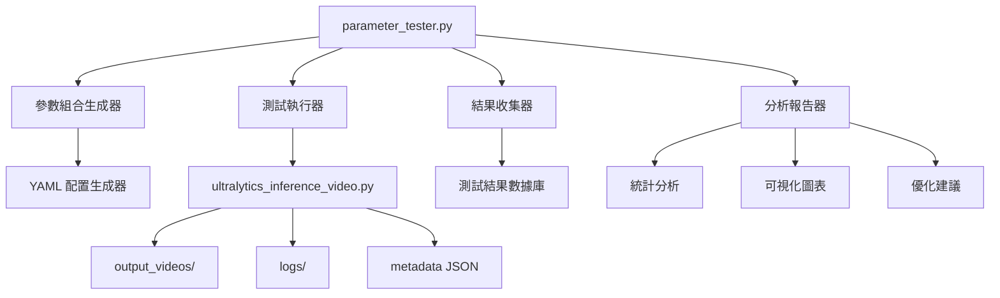
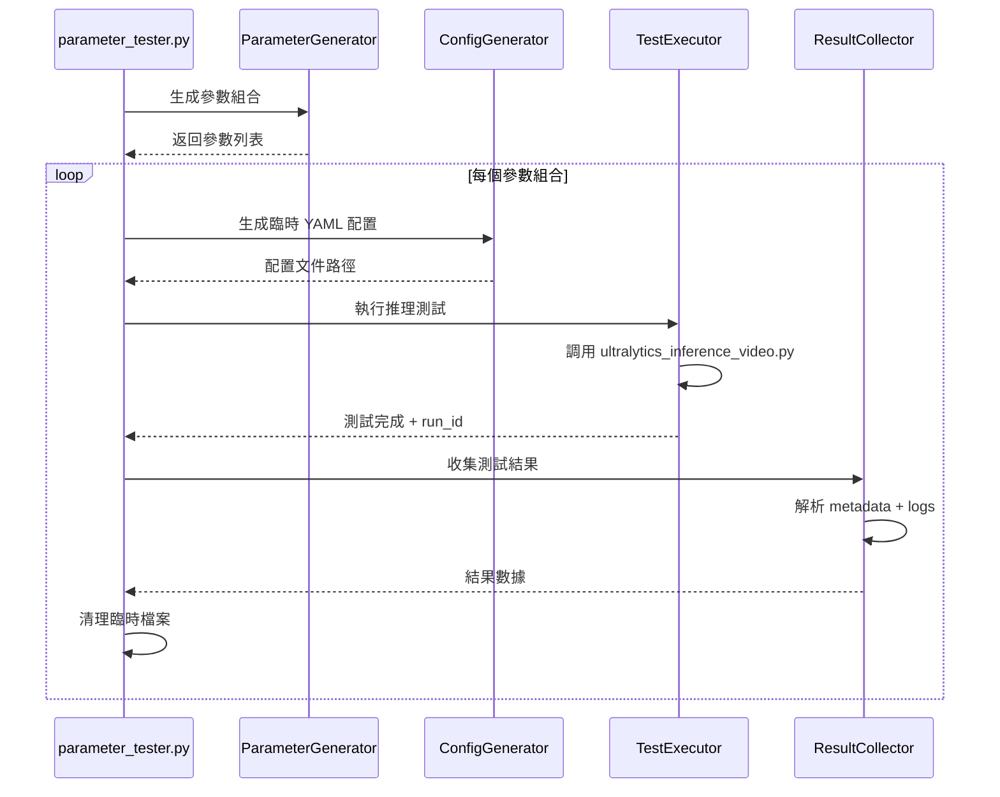

# BoTSORT 參數測試系統設計文件

## 1. 系統架構概覽

基於現有的 [`ultralytics_inference_video.py`](ultralytics_inference_video.py) 系統，設計自動化參數測試框架。

### 核心組件架構



## 2. 參數測試策略設計

### 2.1 核心測試參數（來自 custom_botsort.yaml）

#### 參數定義方式支援

**方式一：明確列表**
```yaml
track_high_thresh: [0.2, 0.3, 0.4, 0.5]
```

**方式二：區間 + 間隔**
```yaml
track_high_thresh:
  range: [0.2, 0.5]
  step: 0.1
# 等效於 [0.2, 0.3, 0.4, 0.5]
```

#### 關聯閾值參數
- `track_high_thresh`: 範圍 [0.1, 0.6], 建議間隔 0.1
- `track_low_thresh`: 範圍 [0.05, 0.3], 建議間隔 0.05
- `new_track_thresh`: 範圍 [0.2, 0.7], 建議間隔 0.1
- `match_thresh`: 範圍 [0.6, 0.95], 建議間隔 0.05

#### 軌跡管理參數
- `track_buffer`: 範圍 [20, 120], 建議間隔 10

#### ReID 相關參數
- `proximity_thresh`: 範圍 [0.1, 0.6], 建議間隔 0.1
- `appearance_thresh`: 範圍 [0.05, 0.3], 建議間隔 0.05

### 2.2 測試策略類型

#### A. 網格搜索（Grid Search）
- 完整組合測試
- 適用於少數關鍵參數的精確調優

#### B. 隨機搜索（Random Search）
- 隨機採樣參數組合
- 適用於快速探索參數空間

#### C. 分層測試（Hierarchical Testing）
- 先測試單一參數影響
- 再測試參數交互作用

## 3. 自動化測試流程設計

### 3.1 測試執行流程



### 3.2 配置管理機制

#### 臨時配置生成
- 基於模板 [`custom_botsort.yaml`](custom_botsort.yaml) 生成變體
- 每個測試組合生成唯一配置文件
- 測試完成後自動清理

#### 測試環境隔離
- 每個測試使用獨立的 run_id
- 結果輸出到獨立目錄
- 避免測試間相互影響

## 4. 結果收集和分析機制

### 4.1 數據收集結構

```python
TestResult = {
    "run_id": str,
    "parameters": dict,  # 測試的參數組合
    "performance_metrics": {
        "avg_inference_time": float,
        "min_inference_time": float,
        "max_inference_time": float,
        "median_inference_time": float,
        "avg_fps": float,
        "frames_processed": int,
    },
    "tracking_metrics": {
        "total_tracks": int,
        "avg_track_length": float,
        "track_switches": int,  # 需要從 logs 解析
    },
    "file_paths": {
        "video_path": str,
        "log_path": str,
        "metadata_path": str,
    },
    "execution_info": {
        "start_time": datetime,
        "end_time": datetime,
        "duration": float,
        "device": str,
    }
}
```

### 4.2 效能指標分析

#### 推理效能指標
- 平均/最小/最大推理時間
- 平均 FPS
- 記憶體使用量

#### 追蹤品質指標

**目前可收集的指標**
- 總軌跡數量（從 metadata 推算）
- 每幀檢測到的物件數量
- 推理效能指標

**未來需要實作的指標**（需要擴展 logging）
- 軌跡連續性分析
- 身份切換（ID Switch）次數
- 軌跡片段化程度
- 新軌跡建立頻率

**實作階段**
- 第一階段：基於現有 logs 和 metadata 的基礎指標
- 第二階段：擴展 ultralytics_inference_video.py 的 logging 功能
- 第三階段：實作進階追蹤品質分析

## 5. 報告生成系統設計

### 5.1 統計分析報告

#### 參數敏感度分析
- 各參數對效能影響的量化分析
- 參數交互作用分析
- 最佳參數組合推薦

#### 效能對比報告
- 不同參數組合的效能對比表
- 追蹤品質 vs 推理速度權衡分析

### 5.2 可視化圖表

#### 參數影響圖
- 參數-效能關係散點圖
- 熱力圖顯示參數組合效果

#### 效能趨勢圖
- 推理時間分佈圖
- FPS 對比柱狀圖

## 6. 系統模組設計

### 6.1 核心模組結構

```
parameter_tester/
├── __init__.py
├── parameter_generator.py    # 參數組合生成
├── config_generator.py      # YAML 配置生成
├── test_executor.py         # 測試執行控制
├── result_collector.py      # 結果收集分析
├── report_generator.py      # 報告生成
├── utils.py                 # 工具函數
└── templates/
    └── botsort_template.yaml
```

### 6.2 配置檔案設計

#### test_config.yaml
```yaml
# 測試配置
test_settings:
  video_source: "RAW_SHORT_VIDEOS/camera-d8accaf0_60s.mp4"
  weights: "models/yolo12x.pt"
  max_concurrent_tests: 2
  cleanup_temp_files: true

# 參數測試範圍（支援兩種定義方式）
parameters:
  # 方式一：明確列表
  track_high_thresh: [0.2, 0.3, 0.4, 0.5]
  
  # 方式二：區間 + 間隔
  track_low_thresh:
    range: [0.05, 0.2]
    step: 0.05
    
  new_track_thresh:
    range: [0.3, 0.6]
    step: 0.1
    
  track_buffer:
    range: [30, 100]
    step: 20
    
  appearance_thresh:
    range: [0.1, 0.25]
    step: 0.05
    
  proximity_thresh:
    range: [0.2, 0.5]
    step: 0.1

# 測試策略
strategy:
  type: "grid_search"  # grid_search, random_search, hierarchical
  max_combinations: 50
  random_seed: 42
```

## 7. 使用介面設計

### 7.1 命令列介面

```bash
# 執行完整參數測試
python parameter_tester.py --config test_config.yaml

# 執行特定參數範圍測試
python parameter_tester.py --param track_high_thresh=0.2,0.3,0.4

# 生成分析報告
python parameter_tester.py --analyze --results-dir results/

# 比較兩個測試結果
python parameter_tester.py --compare run1_results/ run2_results/
```

### 7.2 程式化介面

```python
from parameter_tester import ParameterTester

# 建立測試器
tester = ParameterTester(config_file="test_config.yaml")

# 執行測試
results = tester.run_tests()

# 生成報告
tester.generate_report(results, output_dir="reports/")
```

## 8. 預期效益

### 8.1 自動化效益
- 無人工介入的大規模參數測試
- 標準化的測試流程和結果格式
- 可重現的測試結果

### 8.2 分析效益
- 量化參數對追蹤效能的影響
- 發現最佳參數組合
- 提供調優建議和決策支持

### 8.3 維護效益
- 模組化設計便於擴展
- 詳細日誌記錄便於除錯
- 自動清理機制減少手動維護

## 9. 實作階段規劃

1. **第一階段**: 核心框架實作
   - 參數生成器
   - 配置生成器
   - 基本測試執行器

2. **第二階段**: 結果分析系統
   - 結果收集器
   - 統計分析模組

3. **第三階段**: 報告生成系統
   - 報告生成器
   - 可視化圖表

4. **第四階段**: 優化和擴展
   - 並行測試支持
   - 進階分析功能
   - 使用者介面改善